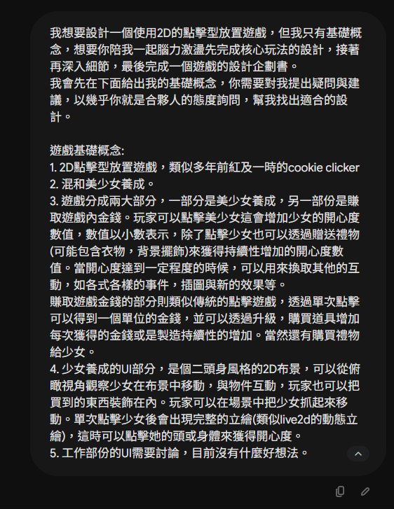
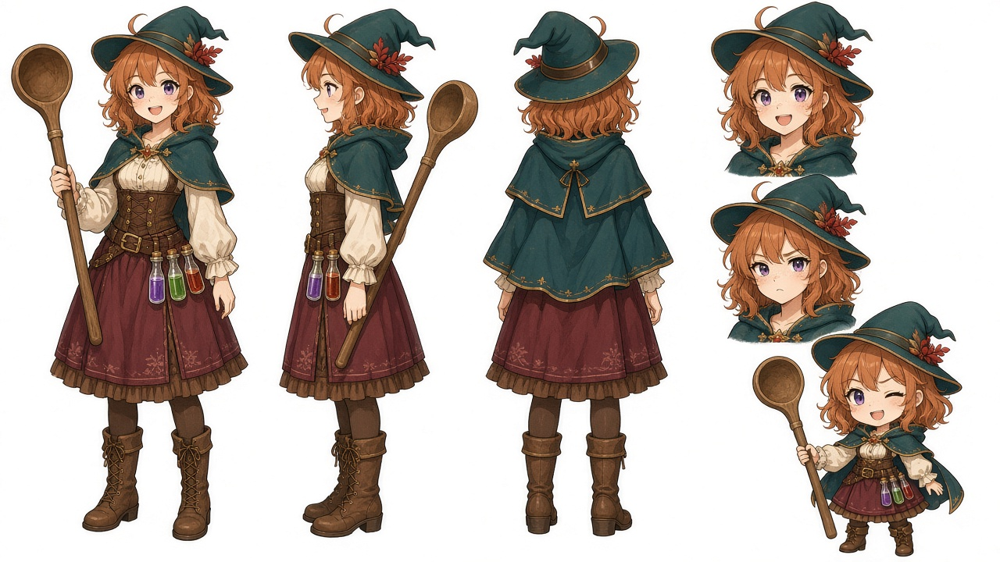
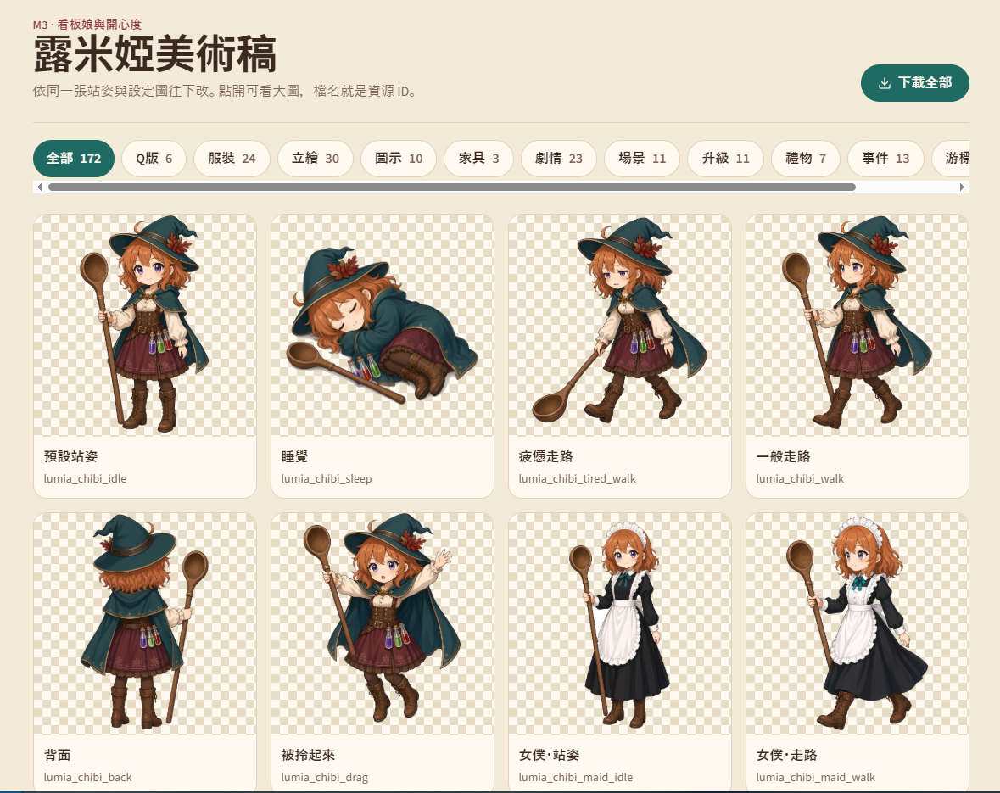
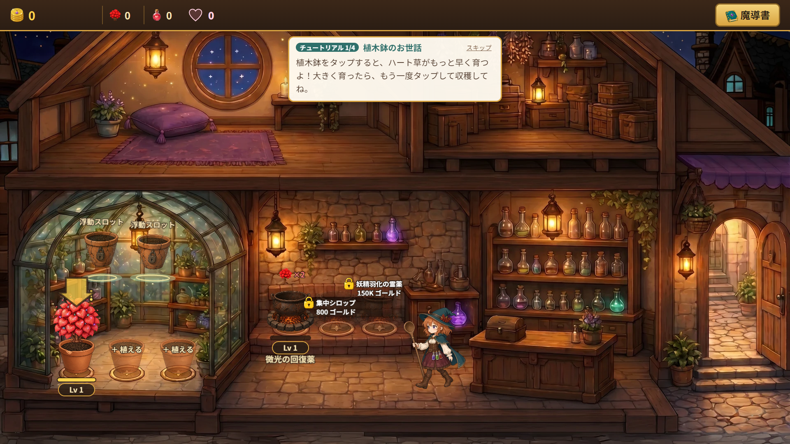
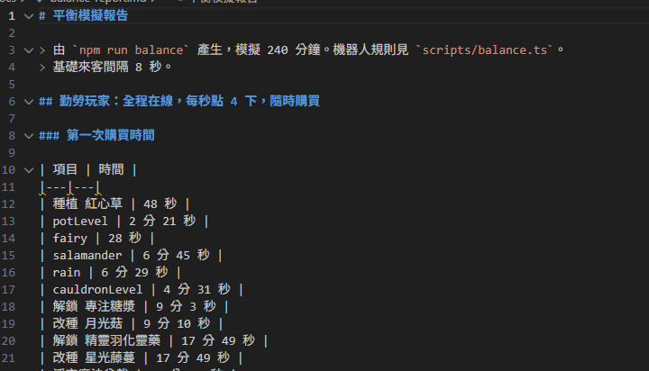
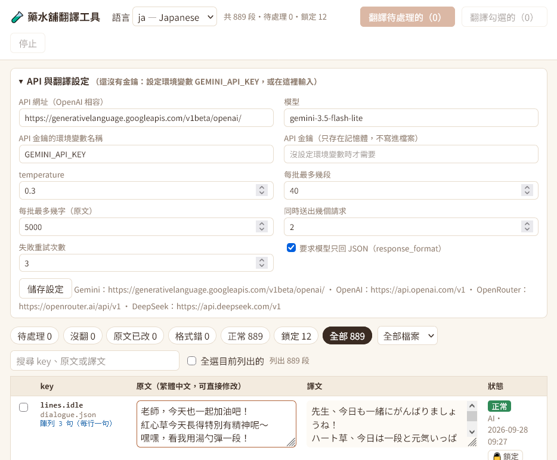
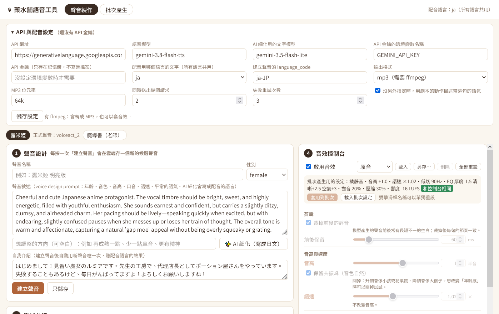
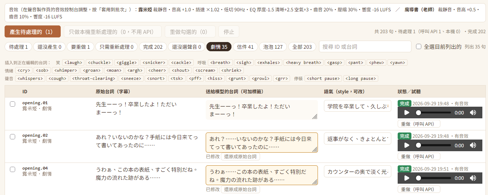
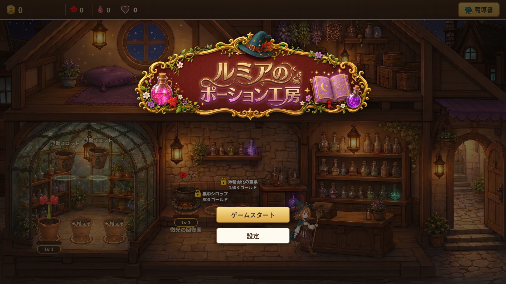

開發筆記

2026/10/03

上周周末，Anthropic 發布了 Opus 5.5，看著離週間額度還有約50%，加上名義上是讓人試用Opus 5.5的重置券。我開始思考究竟能拿來做些什麼事情。

我第一個想到的便是來做一個遊戲。

我的身邊有不少創作者，不管是繪圖、寫作，或是音樂製作的。其中也不乏有對AI的技術感到反感的人。然而我認為，AI終究只是一樣技術(至少目前為止還是)，一個工具。
現在的AI發展是名符其實的日新月異，甚至讓我有了十年前智慧型手機爆發再臨的感覺，或更甚之。以往被人嘲笑的AI問題，也隨著時間漸漸被解決。摸清楚它能幹什麼，不能幹什麼，遠比敬而遠之甚至是感到恐懼來的好得多。

基於如此，對於製作這個遊戲我幫自己訂下了幾個規則。
1. 遊戲要能正常地遊玩，有完整的流程。
2. 遊戲要有完整美術、音樂、系統設計，還有劇情。
3. 能用AI的部分，就讓AI代勞。

對，無論是程式，美術、音樂或是劇情，都是讓AI製作的。不過這當然不是代表什麼東西都讓AI去想，而是使用者，也就是我自己，站在導演的角度，負責分派工作，引導遊戲的細節與製作方向。

在遊戲類型方面。我一開始便有了將點擊類型的遊戲結合養成的想法。但對於其中的細節還需要更進一步的打磨。因此我將想法丟進了Gemini中，要求它與我一起腦力激盪。(會用Gemini純粹是因為不想要浪費Claude的額度)

在與AI討論的過程中，AI提出了建議，我也將自己的想法給了它。最後逐漸定形成了一個加上一點點經營要素的藥水工坊遊戲。當然，這與我一開始的想法有不少的出入，但有了一點雛形，總開始有要開始做點什麼的感覺了。我讓Gemini幫我將討論的內容整理成一個Game Design Document(GDD)，然後便很開心的拿去找了Claude。

Claude很快地就給了我一個prototype，畫面中已經有了溫室、大釜、櫃台、倉庫跟休息區的區分。代表露米婭的文字方塊也會在各個場景中遊蕩。我必須說我當下非常震撼，因為這是第一個prompt，我甚至沒有做其他的修改，就已經有了第一個可以試玩的版本。當然，這時候還沒有任何美術。所以只有一個個的文字方塊顯示在畫面上。

(這邊我沒有留到截圖，只能自行想像了)

有個可愛的角色在畫面上跑來跑去總是比較讓人開心，所以我的下一個目標就是馬上先來製作遊戲美術。我一開始就有了使用Grok來繪製美術素材的想法。不過根據遊戲設計書中的內容，光是主角角色的立繪差分包含畫面上顯示的Q版人物就有十幾張圖的需求，加上各種icon，UI背景。總共需要的圖片至少也有百來張。要怎麼串進工作流中就成了問題。
幸運的是，Grok在近期也加入了Build模式，也就是跟chatGPT或是Claude一樣。在AI Agent後面掛了一台虛擬電腦，它可以直接在虛擬電腦上開發各種功能。而Grok本來就考慮到了遊戲開發的需求，在內部準備了好幾個與圖片生成的skill，當然也能直接調用Grok Imagine的API。

在這些skill當中，也有為了遊戲所需要的「一致性」的要求，所以即使是不同差分也能維持相同的人物設計與元素。經過去背之後，就能直接使用。我一口氣讓Grok幫我完成了背景，各個物件的圖片生成，然後將這些素材匯入了遊戲之中。

而其表現的效果，遠比我想像的要好得多。

這張其實是完成後截的，但其實這時候大致上主要的畫面就沒有什麼更改了。

接著便是與Claude來來回回的試玩與調整，發現哪裡可以加什麼元素，就讓Claude幫我加上去。甚至連遊戲平衡的設計，也是讓Claude幫我寫另外一個script跑完模擬之後決定如何設計的。

至此，遊戲的核心玩法都已經完成了。接著便是進一步的打磨。我決定做三件事情。

1. 加上一個能夠整合遊戲系統的遊戲劇情。
2. 加上日文與英文的多語言對應。
3. 加上語音。

遊戲劇情由我擬定完整的大綱，內容則讓AI幫忙寫我再進行校對與細節修改。(至於內容是什麼，就不再這邊破梗)
接著便是多語言跟語音。多語言的部分，因為不想要浪費claude的額度來做翻譯的簡單工作，我讓它幫我製作了一個可以讓我用API呼叫其他LLM來進行翻譯，管理跟校對的工具。

而語音的部分，也用了類似的方法。語音我選用了Google最近剛推出的gemini-3.8-flash-tts。

這個模型可以先透過聲音設計，調整出符合自己需求的音色，並以同樣的角色生成輸入的台詞。台詞的部分，也能透過各種演技指示的tag達到符合自己需求的演繹方式。

其中值得一提的地方是，因為gemini的審核非常嚴格，想要透過「年輕女性」、「少女」這些prompt做出日本聲優的少女音，聲音比較高圓潤可愛的音色都會被模型擋下來。所以我讓Claude在工具中加了一個音效控制台，在這邊可以微調pitch跟一些基本的濾波器，透過後製來建立理想的聲音。雖然已經說到爛嘴了，但結果真的比我想像的要好的許多。最後在每天跟著gemini-3.8-flash-tts一天只能生成100句的限制搏鬥下，我終於把遊戲中想要的地方都加上了語音。最後加上利用Suno生成的BGM遊戲便大功告成了。

說到這裡，來看看一個非常粗略的統計數據。

這個遊戲的開發是我在周末以及晚上下班後製作的，實際上所使用到的時間大約是50小時左右。
而主要開發使用的Claude，雖然因為是用訂閱的，但使用的token數大約是15.6M，以API價格換算的話大約是
43 USD也就是台幣1400元左右。
加上Grok的圖片生成，因為也是用訂閱制的，稍微換算應該花費在台幣700~800元左右。加上翻譯跟語音生成的API使用費，大約是新台幣300元。
也就是製作這樣內容的遊戲(雖然不算大規模)，但總花費也就台幣2500元上下(其實更低，因為claude只用到訂閱的額度)。

一個人，50小時，2500元。製作一個該有的要素都有的遊戲。我想這是在以往都很難想像的到的。

最後來總結一下。
我覺得我不得不承認，即使現在的AI離AGI這種什麼都辦的到的萬能AI還有不少的距離。但確實已經不是一個懷疑它到底做不做得到，而是我們該怎麼讓它做才能事半功倍的時代了。

(promo video?)
甚至連這部宣傳的影片，從分鏡到剪輯都是完全由AI製作的了。